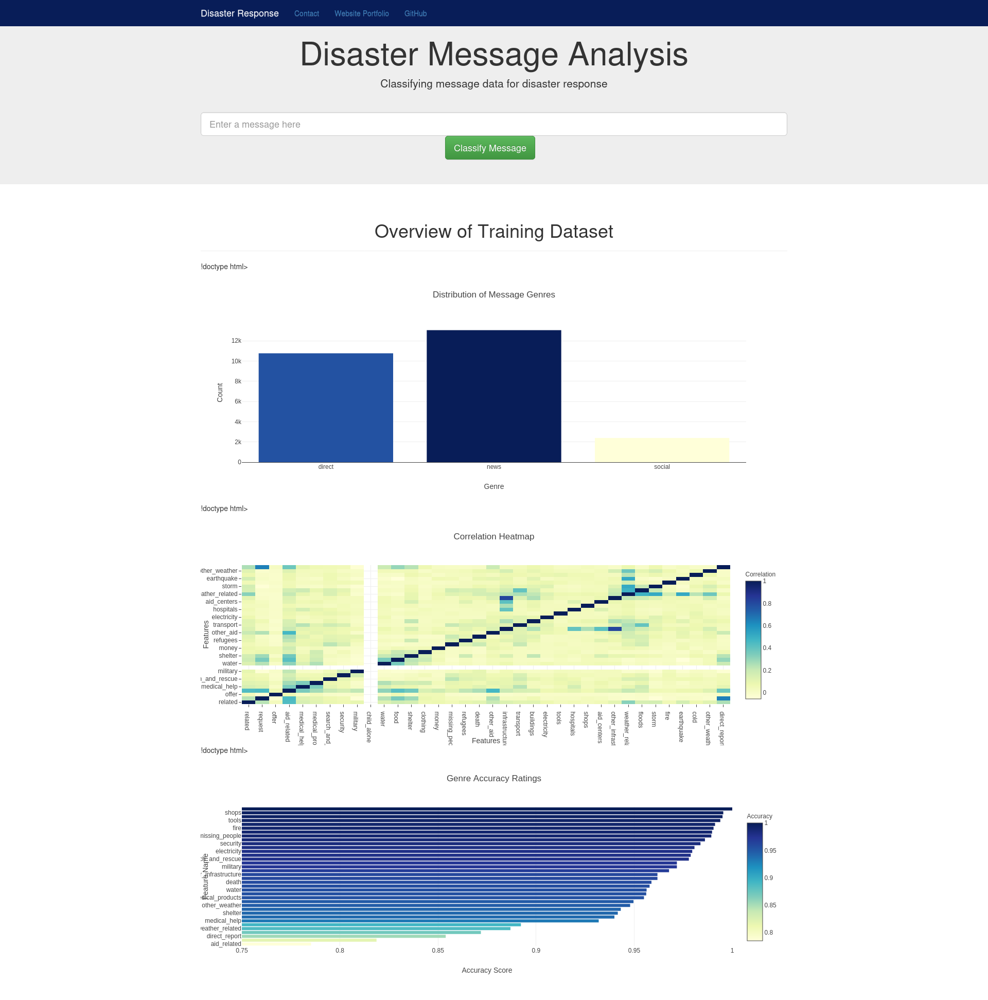

# Disaster-Response-NLP-Pipeline



## Project Summary
This repo contains a Udacity Data Science project that categorizes messages for disaster response purposes through the building, training and implementation of an end-to-end NLP (Natural Language Processing) pipeline along with a companion Flask application. There are several visualizations pre-loaded into the webpage for demonstration purposes.


## Files In This repository
- app
    - templates
        - go.html -- html page loading several components of main page
        - master.html -- main html page loading majority of app components including visualizations
        - screenshot.png -- sample screenshot of successful app launch
    - run.py -- python script that launches Flask application
- data
    - disaster_categories.csv -- CSV file containing message categorizations
    - disaster_messages.csv -- CSV file scontaining disaster messages for categorization
    - DisasterResponse.db -- Database file that is generated from process_data.py for reference tables
    - process_data.py -- python script that cleans data to prep for model training
- models
    - train_classifier.py -- python script that builds, trains, evaluates and saves a model
- README.md - documentation .. this file :)

## Prerequisites
In order to run this application, several installations must be complete upon executing the script "run.py":

1. Python 3.5 or greater is required in order to execute "python run.py" in the working directory
2. Library NLTK is required for natural language processing
3. Several libraries such as Pandas, Flask , Sci-Kit Learn, Plotly, Pickle and others must be pip installed accordingly when running each included Python script

## Intructions
After cloning this repository, our model .pickle file must first be generated by executing the following steps in order.

1. Upon meeting the above listed prerequisite libraries, execute "process_data.py" in terminal within the cloned directory.
```sh
python process_data.py disaster_messages.csv disaster_categories.csv
```
2. Once the data has been processed and cleaned through "process_data.py", we can build, train and save our model by executing "train_classifier.py".
```sh
python train_classifier.py ../data/DisasterResponse.db classifier.pkl
```
3. Once our model has been trained and our model has been dumped into a .pickle file, we can execute "run.py" to launch and render our Flask web application.
```sh
pyhton run.py
```
4. Once the application has been launched, follow the address linked in the terminal and feel free to test out the classification app by typing in a message and clicking "Classify Message"!